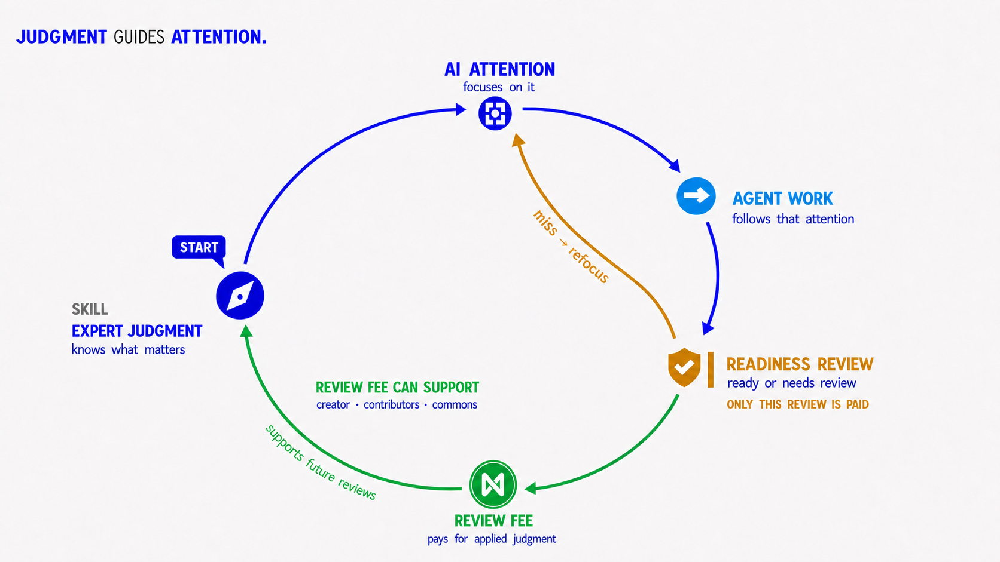

# Lumen Readiness Review Economy

## Thesis

Under the proposed economy, Lumen skills stay open and users pay only for protected readiness review of agent work. The creator defines what the review should notice and when the agent should call it. The review criteria stay protected.

People continue working in Codex, Claude Code, or another AI harness. A NEAR account handles access and payment when a review is called.

## What users pay for

The user pays to apply the creator's protected review to the agent's work. The fee is for that judgment, whether the review returns `ready` or `needs review`.

## Proposed user flow

After the NEAR infrastructure is built:

1. **The user starts in their existing AI harness.** The public skill runs inside Codex, Claude Code, or another AI harness.
2. **The user connects a NEAR account.** The account proves control of that account and handles payment approval.
3. **The user approves the review.** The user sees the price and the exact work and sources selected for review, chooses NEAR or a supported stablecoin, and approves the set and amount.
4. **Lumen runs the protected review.** Lumen receives only the approved set and deletes the submitted content after returning the result.
5. **The user receives the result and receipt.** A `ready` result tells the agent it may continue under the review policy; `needs review` names what the agent must fix. The receipt records the payment, review-version hash, result, and payment split. Creator approval for that hash remains a separate signed record.

## How the readiness review creates value

Each review applies the creator's judgment to the agent's work. It can clear the next move or direct the agent to what needs attention first.

The review fee can support the creator, maintainers, accepted contributors, and the infrastructure that runs the review. The user sees the split before paying.

## Why NEAR

Lumen can use NEAR accounts for access, NEAR Intents for flexible payments, and NEAR AI Cloud for private inference with signed request-and-response evidence. AI Cloud provides evidence that a signed request and response were processed inside an attested trusted execution environment (TEE). A separate creator-signed record must bind the approved review version to its creator.

## Before a paid review

The user sees the price, fee split, and work selected for review before paying.

## Launch path

1. **Start with paid readiness reviews.** Users pay when the creator's protected review is applied to agent work.
2. **Add NEAR access and payments.** Users connect a NEAR account and pay with NEAR or a supported stablecoin.
3. **Add an optional review token.** It can provide review access, reward contributors, and support community decisions.
